# FETCH_CORE/examples/ README

## Folder Breakdown

### `basic tests/`

Basic tests to implements the functionality of `fetch_core/` and demo the basic functionalities of the robot. `fetch_core/` is overkill and initializes almost everything. For reduced overhead (with less abstraction), see `motion_planning/linear_joint_trajectories`.

The main interfaces that you should import into your script are either `skeleton.py` (**recommended**) or `robot_interface.py`.

Anything that uses the Skeleton class and thus the Arm class (`robot.arm`) from `fetch_core` uses Moveit in the functions: `def move_to_joint_goal` and `def move_to_pose`. Make sure to run `roslaunch fetch_moveit_config move_group.launch` in another tty or terminal window ssh'ed into the FETCH before running your script.

Tests, roughly in order of newest to oldest (an `ri` in the name means it's using an alternative "skeleton" interface, `robot_interface.py`). There is also `test_metrics.md` which is included to give you an idea of runtime. We have run all of our tests locally on our FETCH. See below for images.

- `reset_to_base_position.py`: resets the robot to its base position at a height of 0.

- `test_basics.py`: test the robot skeleton class and moving to a pose that's defined w.r.t. the base frame. opens and closes the gripper. takes depth image and sends it to the relative folder,`base_tests/`.

- `test_ri.py`: various tests designed to check if the head, base, torso, camera, gripper, etc., are moving as expected.

- `test_base_and_position_ri.py`: test the robot base movement.

- `test_wrist_roll_ri.py`: used to test why the rviz and physical Fetch robots
  have different wrist rolls, which may be important depending on the
  application.

- `test_gazebo_new_object_ri.py`: used to spawn custom objects in the Gazebo
  simulator. NOTE: this is deprecated, don't use it, and if you want to spawn
  custom objects, talk to either Daniel or Zisu about how to get this. The
  tricky part is getting the object `.sdf` files to be system-independent when
  discussing its paths.

- `test_movement_heuristics.py`: should test heuristics for moving the base of
  the robot in case we can't grasp something from the Fetch's current position. 

### `motion_planning/`

Example `lienar_joint_trajectory` script that simplifies all the classes in `../fetch_core/` files. Details can be found in comments throughout the `linear_joint_trajetories.py` file.

You can 


### `in_progress/`

- `test_camera_to_world.py`: should develop test cases for when the robot goes
  to a pose which was initially specified by its camera coordinates.


## How to Move Downwards with the Skeleton Code

To make the robot move downwards with `test_basics.py` we can create a pose at
the desired target, and it automatically creates a new pose with negative
x-offset w.r.t. that pose. It's negative x since the robot's open gripper always
faces the positive x direction, so if we grasp something on the ground, we want
the negative x-direction so that the robot can lower itself.

Here's the result after creating the pose, where `pose_0_b` is automatically
created as the pose where we (optionally) go to beforehand for safety reasons.

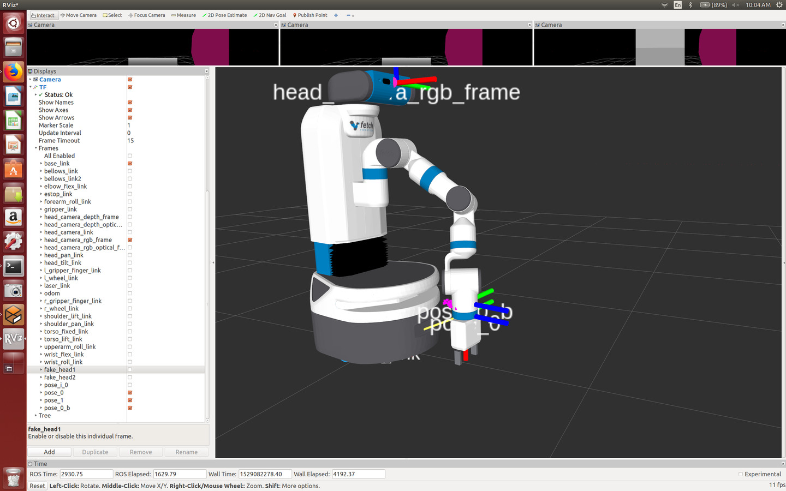

And here's the `wrist_roll_link` just to verify.

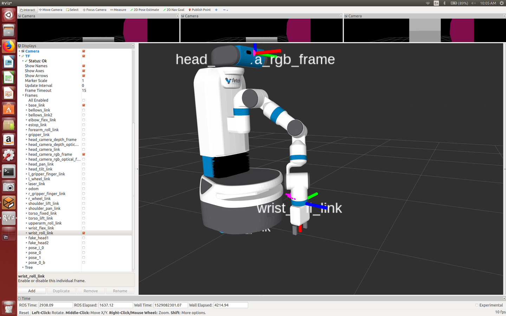


## Wrist Rotation

Using `python test_wrist_roll_ri.py`, we noticed something odd, which we need to
consider for real-world grasping. When we make the robot go to a pose, its wrist
will be "open" and facing the direction of the positive x-axis. However, the
rotation of the wrist roll joint is different by 90 degrees for rviz versus the
physical robot. Let's have the robot go to a grasp point and then adjust its
angle so the `wrist roll` joint is 0 radians.

Here's rviz:

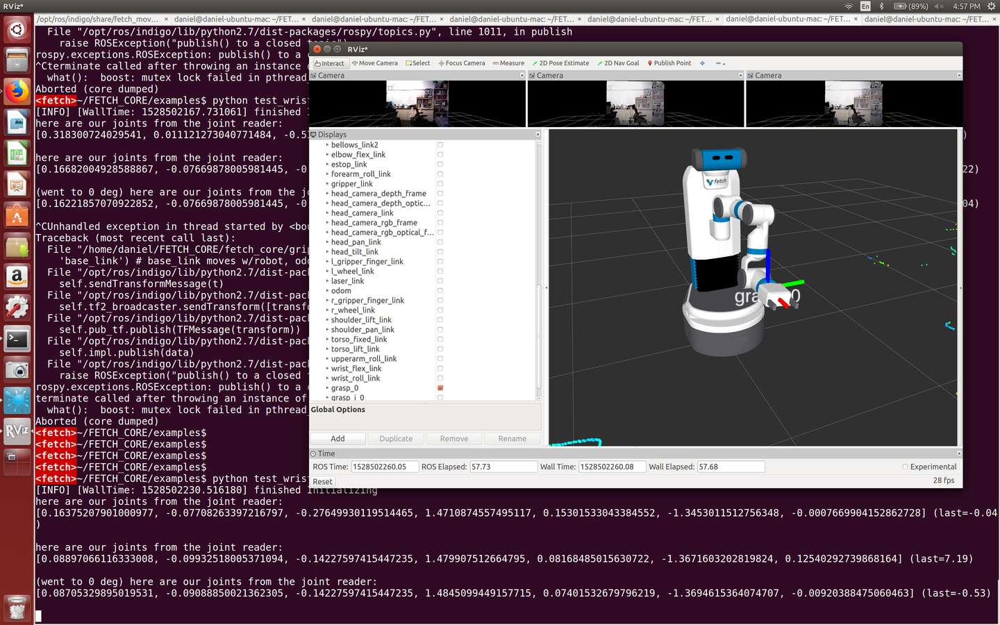

Here's what the real-world looks like:

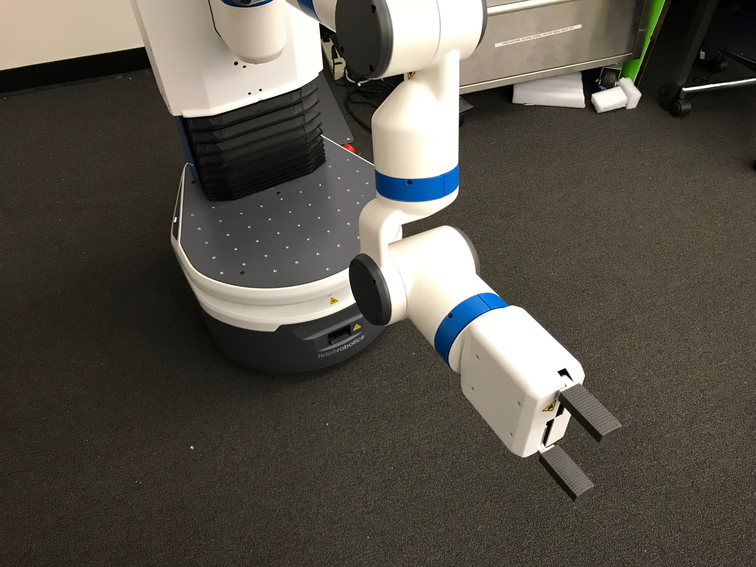

This holds for different rotation angles we tried (45 degrees, etc.). For the
physical Fetch robot, we conclude that:

- **Real world**: *at zero degrees*, the plane formed by the long end of the
  `gripper link` is *perpendicular* (or, doesn't coincide) with the long end of
  the `wrist flex link`.
- **Rviz**: *at zero degrees*, the plane formed by the long end of the `gripper
  link` is parallel (or, coincides) with the long end of the `wrist flex link`.

And then other degrees offset this and have the expected impact in the real
robot or rviz.

In Gazebo+rviz there is no such discrepancy, it's only in real+rviz.

I'm not sure how to fix this now because all we are doing is telling the Fetch
to change the last joint (the wrist roll one) into 0. We will just need to take
this into account.


## Moving to Poses (Outdated but Perhaps Relevant)

**Note 06/15/18: this relies on `robot_interface.py` rather than `skeleton.py`
and may be outdated as we've been changing some of the code, but the images and
discussion may still be relevant even if the code fragments here aren't.**

Here is the pipeline **when testing using the simulator**:

Run `roslaunch fetch_gazebo simulation.launch` in a command line.

In another window: `roslaunch fetch_moveit_config move_group.launch`.

In *another* window: `rosrun rviz rviz`.

Finally, in a fourth window, run `python test_move_to_pose.py`.

For the physical robot, it's similar except you don't need to run the Gazebo
simulator. You need to connect with the robot for rviz to display it, though.

A few pointers:

- In `robot_interface.py` we have `move_to_pose()` which will take in a pose. In
  application code, this given pose will be something that results from a
  complicated pipeline which translates from camera coordinates to position and
  orientation.
  
- If we just want to test that the robot is going somewhere, then it's easiest
  when we can define a pose with respect to the `base_link` of the robot (which
  moves with the robot, unlike `odom`). That way we can just tell the
  end-effector to be x meters in front of it, y meters to the right/left
  (depending on perspective), etc.

- To make the pose, simply call `create_grasp_pose()` with `intuitive=True`.

- To accommodate the above, in `gripper.py`, instead of assuming the pose came
  from a camera originally, we have an "intuitive" setting which lets us define
  a pose with respect to the base link. Either way, a new thread is started
  which creates the pose.

- We left `arm.py` unchanged. We are just calling its `move_to_pose` and that
  uses MoveIt.


Some stuff to investigate:

- How to control the speed to make it slower.

- How to figure out if there will be collisions with the base, etc.

- How to avoid locks and issues with multiple frames.

## Results for Creating Poses

Here's what we get after running the test with these critical lines:

```
def debug_pose_location_rviz():
    pose0 = robot.create_grasp_pose(1, 0, 0, 0, intuitive=True)
    time.sleep(2)
    pose1 = robot.create_grasp_pose(1, 0, 0, 90*DEG_TO_RAD, intuitive=True)
    time.sleep(2)
```

TL;DR: create two poses in front of the robot by x=1 meter. The first pose has
the identity rotation, and the second pose should be rotated 90 degrees about
the z-axis. Each of these calls will create *two* frames: `grasp_i_k` and then
`grasp_k`, where `k` is an index starting at 0 and incrementing sequentially.

By default, `grasp_i_k` is only defined with a position offset w.r.t.
`base_link`, with the identity rotation. The rotation that we pass in
`robot.create_grasp_pose()` is for the `grasp_k` pose and that is rotation
w.r.t. `grasp_i_k`.

Here's what we get:

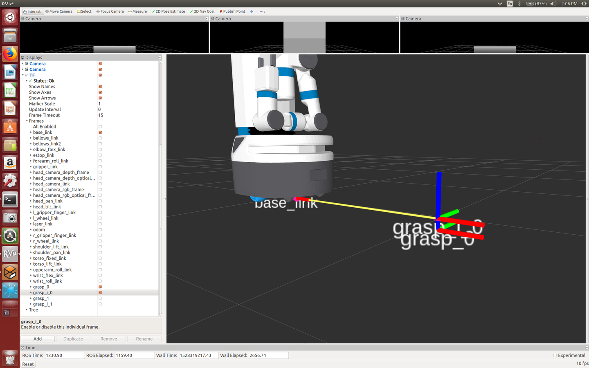

Let's remove the robot model. Now we can see the `base_link`:

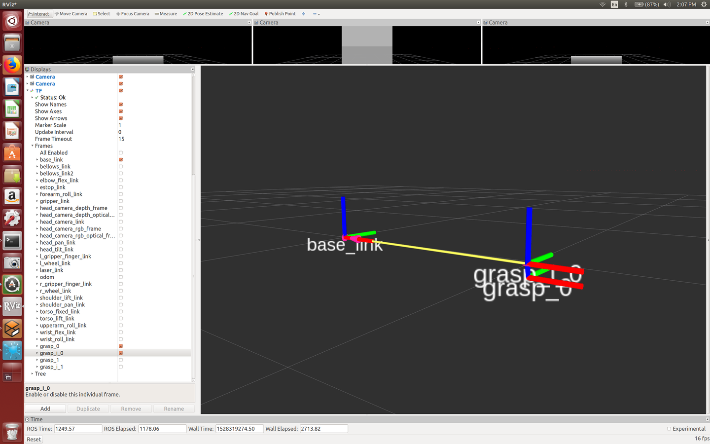

Above, I've highlighted `grasp_i_0` and `grasp_0`. The `grasp_i_0` frame is at
the expected spot,  1 meter in front of the robot (since that's the x-axis
direction) and with no rotation.

The `grasp_0` is -0.05m above (hence, 0.05m *below*), because of some hard-coded
decisions in `Gripper.loop_broadcast_intuitive()`; I think this is supposed to
represent an offset to take into account the robot's gripper when lowering or
raising it. This is something we'll need to tune.

Now let's highlight `grasp_i_1` and `grasp_1`:

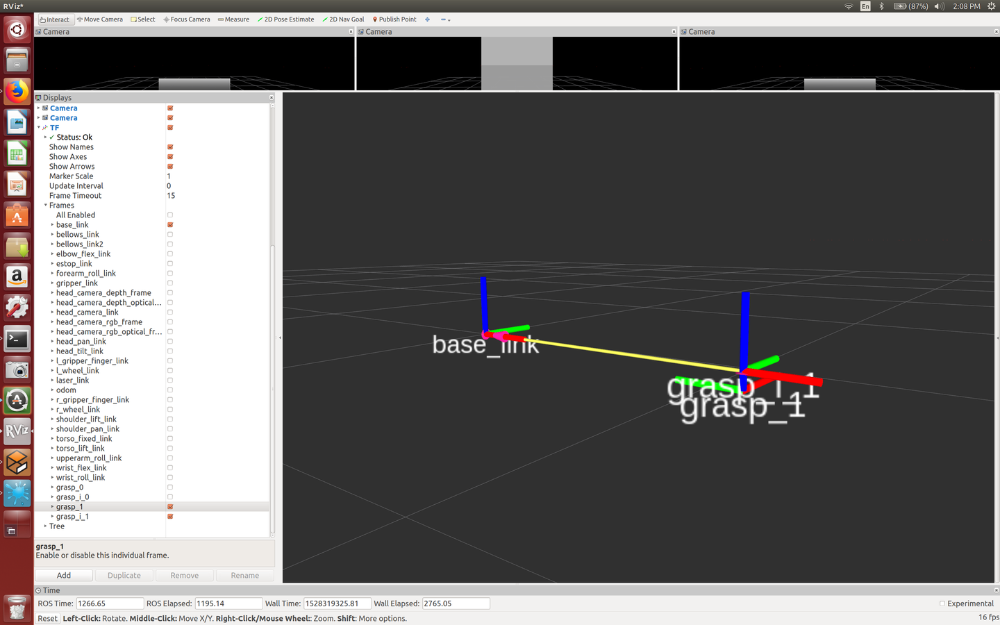

As expected, `grasp_i_1` coincides with `grasp_i_0` but `grasp_1` not only has
the usual -0.05m offset in the z-direction, but is also rotated 90 degrees about
the z-axis.

The offset of -0.05m should be tuned appropriately for the application. Also, in
the Siemens code we have, the `grasp_i_k` poses should have some non-identity
rotation w.r.t. the `base_link`, so the visualization won't be as interpretable
as it appears here.


## Results for Moving to Poses

For the results here, I removed the offset of -0.05m, so `grasp_k` has the same
origin (but not necessarily the same rotation) as `grasp_i_k`. So now we only
visualize `grasp_k` poses. Using

```
pose = robot.create_grasp_pose(0.75, 0, 0.5, 0, intuitive=True)
time.sleep(2)
robot.move_to_pose(pose, z_offset=0.0)
```

in addition to the two poses we created earlier, we have this result:

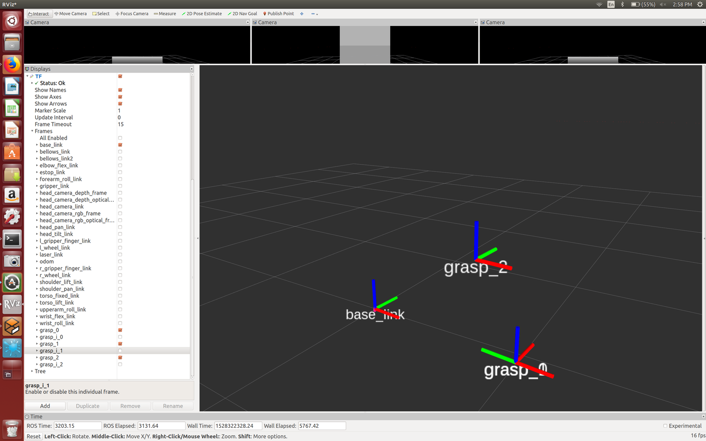

and with the robot:

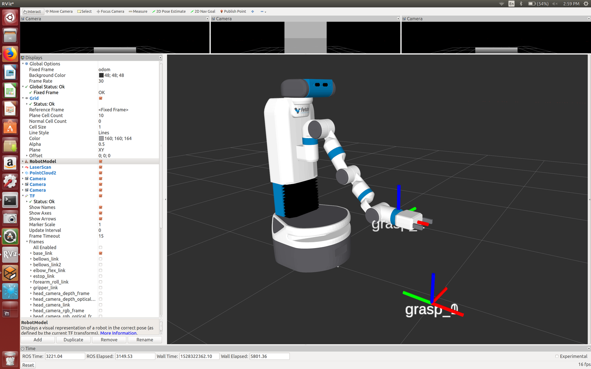

Good, the robot moved 3/4 meters in front, half a meter up. **WARNING**: if the
target pose is too low (or the torso is too low), then the robot's arm MAY 
COLLIDE with its base. I assume motion planning should take care of this, but
I'm not 100% sure. Be careful and test in simulation beforehand.

Let's do the same, with a z-offset of 0.1 now:

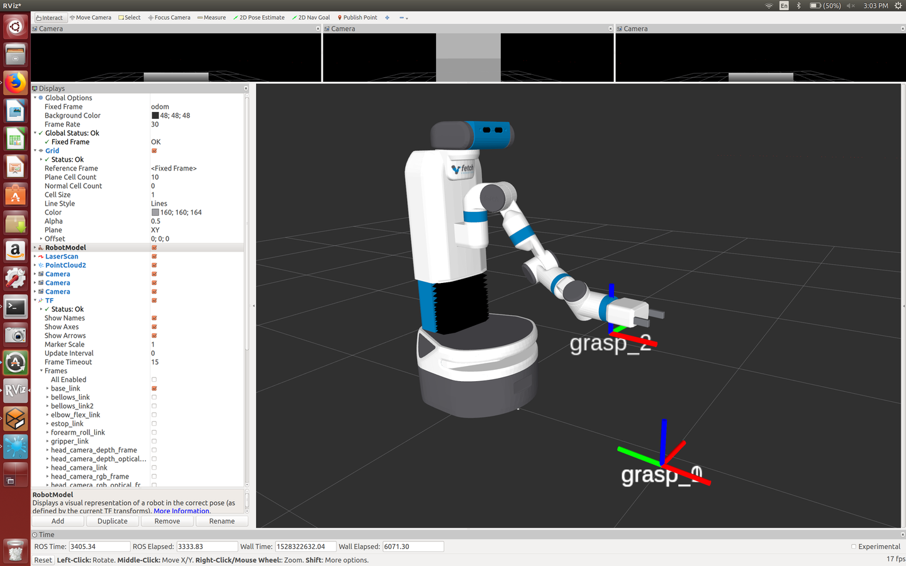

Looks good! It went 0.1m higher.

Now what if we change the orientation of `grasp_2`? Let's reset the z-offset to
zero and set the pose to be:

```
pose = robot.create_grasp_pose(0.75, 0, 0.5, 90*DEG_TO_RAD, intuitive=True)
```


Ah, planning failed for this one! :(  It also failed for -90 degrees. The reason
is that the robot's wrist has to "turn" and the arm isn't long enough to get it
by that angle. That kind of makes sense. Let's use -90 deg (since it's easier
for the wrist to face that way) and move the target shorter to 0.5m, not 0.75m:

```
pose = robot.create_grasp_pose(0.5, 0, 0.5, -90*DEG_TO_RAD, intuitive=True)
```

Fortunately, it is able to reach there! And it should be clear what the rotation
parameter now means, it rotates about the z-axis, faces in the x-axis.


I tested a few other variations of this, and the open end of the gripper always
ends up "facing" the x-axis direction.

For example you can make it point downwards if you define the pose correctly.
Go inside `gripper.py` to adjust rotation in the x and y directions w.r.t. the
base link as desired (in radians). Here, I made it point down at height 0.3:

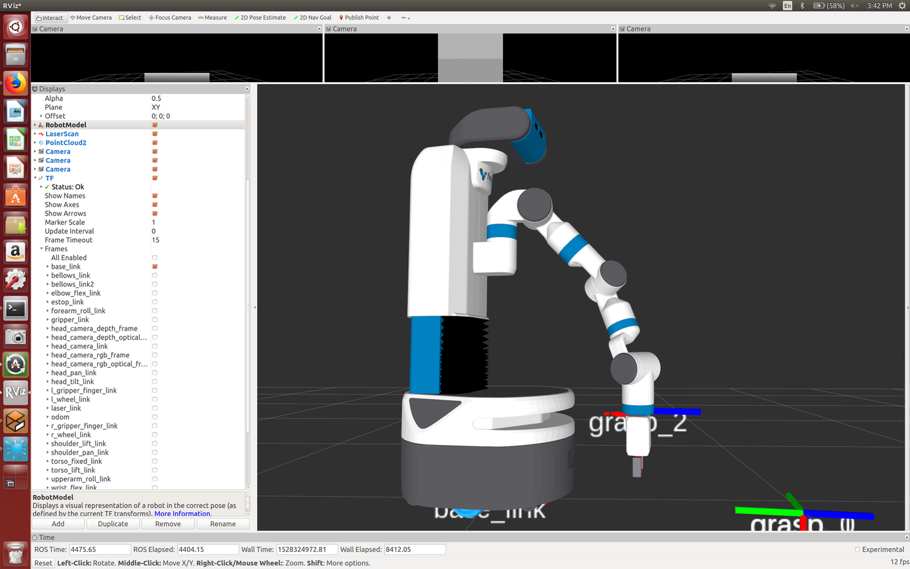

The Fetch correctly did the motion planning to avoid collisions with the base.
**It came *very* close to hitting the base a few times, though!** So test in
simulation. 

I could not get it lower than a height of 0.3, but I'm sure I could do it with
some tuning of the positioning.


# Base Rotation and Forward Movement

From running `python test_base_and_position_ri.py`:

## Rotation

Testing the base *rotation* movement, where I make the robot turn X degrees,
then -X degrees, and try to see if it comes back to the target.

```
Results at -90 then 90 degrees, speed 0.3
(1) success, 1-2 distance, angle off 5 deg, went backwards
(2) failed first turn, only -20 deg
(3) failed first turn, only -10 deg
(4) failed first turn, only -5 deg
(5) failed second turn, but first angle overshot target by 20 deg

Results at 30 degrees, then -30 degrees, speed 0.3
(1) success, back 2cm, angle off 5 deg, went backwards
(2) success, back 2cm, angle good, went backwards
(3) failed first turn, only 5 deg
(4) failed first turn, only 2 deg
(5) success, back 2cm, angle good, went backwards

Results at -30 degrees, then 30 degrees, speed 0.3
(1) success, but after long delay (~20 sec) on _second_ turn
(2) success, but I had to physically nudge the robot since it was slow/stuck
(3) success, angle great back 2cm
(4) success, angle off 10 deg, back 2cm
(5) success, angle good, back 2cm
```

All result angles are obviously eyeball estimates. If it fails, it was
stuck for 10 or more seconds (I counted). After the first few trials it's
clear that the rotation axis isn't at the true center since the robot
repeatedly moves _backwards_ despite rotating X and then -X degrees. All
this is with the torso lowered to 0.03m to be safe.

## Forward Movement

Testing the base *forward* movement with `test_forward` method for moving the
robot 0.1 meters (10 centimeters) each time:

```
Now test with speed = 0.1 meters/sec

[WallTime: 1527719306.638319] start_pose: [-0.0096 -0.0001  0.9977]
[WallTime: 1527719309.881714] pose:       [ 0.1276  0.0007  0.3874]
[WallTime: 1527719309.882126] xy distance: 0.1372

[WallTime: 1527719367.568807] start_pose: [ 0.1276  0.0007  0.3874]
[WallTime: 1527719370.772539] pose:       [ 0.2615  0.0015  0.3729]
[WallTime: 1527719370.772919] xy distance: 0.1339

[WallTime: 1527719418.625483] start_pose: [ 0.2615  0.0015  0.3729]
[WallTime: 1527719421.869432] pose:       [ 0.3982  0.0024  0.3729]
[WallTime: 1527719421.870001] xy distance: 0.1368

[WallTime: 1527719458.508835] start_pose: [ 0.3982  0.0024  0.3729]
[WallTime: 1527719461.710364] pose:       [ 0.5315  0.0032  0.3293]
[WallTime: 1527719461.710722] xy distance: 0.1333

[WallTime: 1527719500.833941] start_pose: [ 0.5315  0.0032  0.3293]
[WallTime: 1527719504.037288] pose:       [ 0.6664  0.0039  0.2131]
[WallTime: 1527719504.037762] xy distance: 0.1349

Now test with speed = 0.2 meters/sec

[WallTime: 1527719599.782686] start_pose: [ 0.6664  0.0039  0.2131]
[WallTime: 1527719602.625932] pose:       [ 0.8543  0.0043  0.0969]
[WallTime: 1527719602.626325] xy distance: 0.1880

[WallTime: 1527719645.532461] start_pose: [ 0.8543  0.0043  0.0969]
[WallTime: 1527719648.535771] pose:       [ 1.0376  0.0036 -0.2664]
[WallTime: 1527719648.536151] xy distance: 0.1833

[WallTime: 1527719693.510821] start_pose: [ 1.0376  0.0036 -0.2664]
[WallTime: 1527719696.314423] pose:       [ 1.2232  0.0022 -0.4553]
[WallTime: 1527719696.314802] xy distance: 0.1856

[WallTime: 1527719738.526260] start_pose: [ 1.2232  0.0022 -0.4553]
[WallTime: 1527719741.369464] pose:       [ 1.4047  0.0006 -0.5279]
[WallTime: 1527719741.369885] xy distance: 0.1816

[WallTime: 1527719788.585682] start_pose: [ 1.4047  0.0006 -0.5279]
[WallTime: 1527719791.388903] pose:       [ 1.597  -0.0015 -0.6441]
[WallTime: 1527719791.389317] xy distance: 0.1923
```

These results imply that commanding a 10cm move means the robot actually moves
about 13.5cm at speed 0.1 and 18.5cm at speed 0.2, so it badly overshoots.  As
expected, faster speeds overshoot. I think overshooting happens because the code
always checks and waits if we've reached a certain distance, so it won't stop
beforehand. If the robot moves larger distances, for fixed speed, the
overshooting error should hopefully stay the same which means relatively it is
closer to the target.

Also, I turned the robot on and didn't modify the position before proceeding
with experiments, and I note that the y-coordinate can be off by a few
millimeters (should be 0 throughout). But that's probably not a concern.

Let's move for longer distances, so 20cm:

```
Now test with speed = 0.1 meters/sec

[WallTime: 1527723056.326300] start_pose: [   0.5742    0.1444  177.5047]
[WallTime: 1527723061.090067] pose:       [   0.3403    0.157   175.6014]
[WallTime: 1527723061.090457] xy distance: 0.2342

[WallTime: 1527723136.295692] start_pose: [   0.3403    0.157   175.6014]
[WallTime: 1527723139.537986] pose:       [   0.102     0.1747  175.7031]
[WallTime: 1527723139.538535] xy distance: 0.2390

[WallTime: 1527723177.866473] start_pose: [   0.1031    0.1746  175.7031]
[WallTime: 1527723181.308761] pose:       [  -0.1296    0.1919  175.7612]
[WallTime: 1527723181.309201] xy distance: 0.2333

Now test with speed = 0.05 meters/sec

[WallTime: 1527723225.764847] start_pose: [  -0.1296    0.1919  175.7612]
[WallTime: 1527723231.407195] pose:       [  -0.3453    0.2078  175.7321]
[WallTime: 1527723231.407562] xy distance: 0.2163

[WallTime: 1527723269.286191] start_pose: [  -0.3443    0.2077  175.7176]
[WallTime: 1527723274.568423] pose:       [  -0.5602    0.2238  175.674 ]
[WallTime: 1527723274.568809] xy distance: 0.2165

[WallTime: 1527723446.533462] start_pose: [  -0.5602    0.2238  175.674 ]
[WallTime: 1527723451.775800] pose:       [  -0.7754    0.2401  175.6304]
[WallTime: 1527723451.776196] xy distance: 0.2158
```

With a speed of 0.1 m/sec we get the same errors as before, as expected. With
0.05 m/sec we halve the error. So it seems like 0.05 m/sec could be a reasonable
speed for us.

Of course this assumes that the distance returned from the odometry base is
actually accurate (that's the thing that lets us detect `start_pose` and
`pose`).


[1]:http://mirror.umd.edu/roswiki/doc/diamondback/api/tf/html/python/tf_python.html
